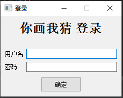

# YouDrawIGuess
**基于PyQT5和原生Socket的原生你画我猜游戏实现**。不依赖于其他例如PyGame等的游戏框架和Twisted的网络框架的轻量级实现，只实现基本游戏功能，部分BUG尚未修复（例如稳定性和用户操作鲁棒性兼容）。采用Client-Server架构，使用Server协调Client之间的通信和游戏逻辑的控制。游戏演示界面如下所示

## 运行游戏
### 服务器端Server
运行 [server/core.py](https://github.com/Asichurter/YouDrawIGuess/blob/main/server/core.py) ，不需要指定参数。服务器日志将会打印在控制台。**如果你是在自己的机器上运行服务器端，由于现在家庭宽带组网中NAT较为常见，终端都使用DHCP分配的私有IP，外网无法直接使用该IP访问终端，无法直接实现客户端和服务器端的通信，因此需要一定的方法打洞**。最好还是直接用一些免费的内网穿透（实际就是中转服务器重新映射了一下）例如花生壳来实现。本游戏流量很小，用一下免费版完全不成问题。开启服务器端之前记得打开内网穿透映射，将映射位置调整为本机的IP，端口具体的话根据config中参数调整。
### 客户端Client
运行 [client/core.py](https://github.com/Asichurter/YouDrawIGuess/blob/main/client/core.py)，不需要指定参数，服务器日志也会打印在控制台。**运行客户端之前必须保证服务器端已经运行**。
### 参数调整Configuration
设置[config/__init__.py_](https://github.com/Asichurter/YouDrawIGuess/blob/main/config/__init__.py)中的参数，内置连接相关的参数（服务器地址和端口），窗口相关参数（窗口大小，画图框大小等），游戏参数（画图者、猜对者得分，每一轮游戏时间限制等），服务器相关参数（停止接受新玩家连接的检查时间间隔等）和画图相关参数（默认笔粗细和颜色等）。
### 账号设置Accounts
游戏登录的账号全部位于[server/account.json](https://github.com/Asichurter/YouDrawIGuess/blob/main/server/account.json)中，以JSON“键-值”对与“玩家名-密码”对应的方式存储，登录时必须使用该账户文件中存在的账户名和密码进行登录。账户文件的位置可以通过修改config中参数的“UsrAccountAddr”来修改，支持（*server/core.py*的）相对路径和绝对路径

## 进行游戏
### 玩家登录
运行客户端的 [client/core.py](https://github.com/Asichurter/YouDrawIGuess/blob/main/client/core.py)后将会直接进入登录界面，如下图所示：

**相同的玩家不能重复登录**。登录成功之后将会直接进入到游戏主界面，如最上主图所示。第一个登录成功的玩家将会被指定为主机(host)，主机拥有开始游戏的权力，表现为界面左下角将会出现“开始游戏”的按钮，而其他后续登录的非主机玩家将不会出现该按钮。点击“开始游戏”之前玩家可以任意登录进入，默认最多为4个玩家，可以通过config中的"MaxGamer"来修改，一般建议不超过4个，否则不保证界面完整性。超过玩家最大限制时会在登录时就提示登录失败。

### 等待登录
由于第一个登录成功的玩家会被指定为主机，因此主机总是第一个进入房间的。进入房间后可以等待其他玩家进行登录，登录过程多线程可以并列进行。主机可以随时按下“开始游戏”按钮来终止更多玩家的进入。一旦一个玩家成功登录将会自动进入房间，并显示在左侧的玩家列表中。此时由于服务器尚未开始接受客户端发送的请求，暂时不能聊天。

### 开始游戏
- **游戏绘图**：主机按下“开始游戏”按钮后游戏即开始，游戏的每一轮将会由所有玩家进行一次绘图，游戏的轮数由config中的MaxRound参数控制。绘图玩家首先被要求进行出题，给出一个谜底和提示（谜底是必须的，提示是非必须的），使用鼠标左键直接绘图，可以在下方的工具栏中选择清空画板，更换画笔颜色、粗细和使用橡皮擦等。绘图将会实时同步到其他玩家的画板上，但是非画图玩家无法绘图，也无法操作工具栏。

- **玩家聊天和猜谜底**：游戏进行过程中所有玩家都可以在右侧聊天框中打字进行聊天，同时也可以在聊天框中输入猜测的谜底答案。如果猜对了，服务器将会给该玩家加分，同时公告该玩家已经答对答案，给出的答案也不会出现在其他玩家的聊天框中；如果聊天内容跟答案不一致，则将会被判定为普通的聊天，显示在所有玩家的聊天框中。**如果反复作答正确答案，玩家也不会重复加分**，而且答案会显示在所有玩家的聊天框中，因此不推荐这么做。

- **游戏时间**：每一轮游戏拥有一个最大游戏时间，显示在画板上方。时间到时或者所有玩家都猜对了答案时将会自动进行下一轮游戏，由新的玩家出题并绘图。

## TODO
- [x] 超额玩家登录逻辑扫尾
- [ ] 服务器端已连接玩家登录超时和进入游戏状态后的后续登录无响应处理
- [ ] 游戏进行中玩家断开连接server端错误处理
- [ ] 游戏结束后的结算
- [ ] BUG检查……